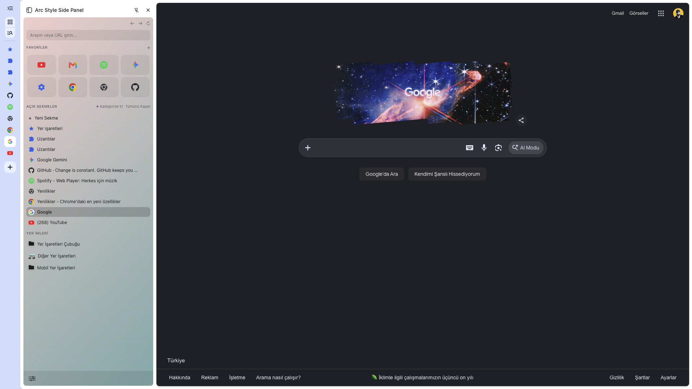

##  🇬🇧 English Description
---

# Arc Style Side Panel for Chrome

A clean, modern, and customizable Chrome Side Panel extension inspired by Arc Browser. It features a dark theme, custom glassmorphism components, fixed noise background overlays, vertical tabs management, hierarchical bookmarks, and a 4-column drag-and-drop favorites grid.

---
### 💡 Pro Tips for Best Experience (True Arc Experience)

To get the most seamless, distraction-free Arc Browser experience in Google Chrome, we recommend the following setup:

1. **Hide the Bookmarks Bar:** Press `Ctrl + Shift + B` (or `Cmd + Shift + B` on Mac) to hide Chrome's native horizontal bookmarks bar.
2. **Hide Chrome's Native Tab Bar:** Open Chrome settings or use native flags/extension shortcuts to collapse/hide horizontal tabs when working in full screen. 
3. **Chrome - Settings - Appearance - Tab Position - Vertical** And Side Panel Location -> Left
4. Collapse tabs `shift+cmd+L`
5. **Pin the Side Panel:** Click the Side Panel icon in Chrome's top-right toolbar and pin it for instant `Ctrl + Command + S` / keyboard shortcut access.
6. **Use Full Screen / Clean Mode:** Combine with Chrome's distraction-free fullscreen mode (`F11` or `Cmd + Ctrl + F`) to let your side panel serve as the main navigation hub.

---

### 💡 Motivation & Behind the Project

Arc Browser revolutionized web navigation with vertical tabs and a sidebar-centric workspace. However, with recent strategic shifts from its parent company slowing down Arc's development and leaving its long-term future uncertain, relying on a custom browser feels risky. Chrome and the Chromium ecosystem remain the most stable, reliable, and future-proof foundation.

I created this extension to:
1. **Future-Proof the Arc Experience:** Keep the best parts of Arc (vertical tabs, glassmorphism UI, pinned grid) on top of Google Chrome's robust and secure foundation.
2. **Native & Lightweight:** Leverage Chrome's built-in Side Panel API (Manifest V3) without needing a full browser switch or heavy third-party software.
3. **True Open Source & Free Distribution:** Built to be 100% free, open-source (GPL-3.0), and community-driven via GitHub—skipping store fees and restrictions.

---

### 🚀 Key Features

* **Arc-Inspired Aesthetics:** Dark gradient background with custom grain/noise overlay and full glassmorphism footer bar.
* **Smart Drag-and-Drop Grid:** 4-column favorites layout with interactive matrix shift animations (up to 8 pinned items).
* **Hierarchical Bookmarks:** Smooth accordion animation for folder trees using vector folder states.
* **Multilingual Support (i18n):** Toggle seamlessly between English and Turkish via the settings popup.
* **Clean UI & Layout Isolation:** Fixed noise overlays and isolated scroll areas to prevent visual glitches across panel resize operations.

---

### 📦 Installation (Developer Mode)

1. Clone or download this repository.
2. Open Chrome or Chromium based browser and navigate to `chrome://extensions`.
3. Enable **Developer mode** in the top-right corner.
4. Click **Load unpacked** and select the extension folder.

---

### 🎨 Credits & Attributions

This extension uses icons provided by **[Flaticon](https://www.flaticon.com/)** under their free license with attribution. Special thanks to the creators:

* **Equalizer / Settings Icon:**
  * Created by **[Freepik](https://www.flaticon.com/authors/freepik)** - [Flaticon](https://www.flaticon.com/free-icon/equalizer_2989861)
* **Folder Icons (Closed & Open Folder Vectors):**
  * Created by **[Smashicons](https://www.flaticon.com/authors/smashicons)** - [Flaticon](https://www.flaticon.com/free-icon/folder_456793)
 
---   
### 📄 License

Distributed under the MIT License. See `LICENSE` for more information.

---

## 🇹🇷 Türkçe Açıklama
---
# Chrome İçin Arc Stili Yan Panel

Arc Browser'dan esinlenilerek geliştirilmiş; sade, modern ve kişiselleştirilebilir bir Chrome Yan Panel (Side Panel) uzantısı. Koyu tema, cam efekti (glassmorphism) bileşenleri, sabit gren/noise arka plan kaplaması, dikey sekme yönetimi, hiyerarşik yer imleri ve 4 sütunlu sürükle-bırak favori grid yapısı sunar.

---

### 💡 En İyi Kullanım Deneyimi İçin İpuçları (Gerçek Arc Deneyimi)

Google Chrome üzerinde tam bir Arc Browser atmosferi yakalamak ve odaklanmış bir çalışma ortamı oluşturmak için şu adımları uygulamanızı öneririz:

1. **Yer İmleri Çubuğunu Gizleyin:** Üstteki yatay yer imleri çubuğunu kaldırmak için `Ctrl + Shift + B` (Mac'te `Cmd + Shift + B`) kısayolunu kullanın.
2. **Arama ve Üst Çubuğu Minimize Edin:** Tam ekrana geçtiğinizde (`F11` veya Mac'te `Cmd + Ctrl + F`) veya varsayılan yatay sekmeleri gizlediğinizde yan panel tek ana navigasyon merkeziniz haline gelir. 
3. **Chrome - Ayarlar - Görünüm - Sekme Konumu - Dikey** ve Yan Panel Konumu Left
4. Sekmeleri Daraltın `shift+cmd+L`
4. **Yan Paneli Sabitleyin:** Chrome'un sağ üst araç çubuğundaki Yan Panel simgesine tıklayıp sabitleyerek tek tıkla veya kısayolla hızlıca erişin.
   
---

### 💡 Projenin Çıkış Hikayesi ve Motivasyon

Arc Browser, dikey sekmeleri ve kenar çubuğu odaklı çalışma alanıyla web gezinme alışkanlıklarını değiştirdi. Ancak geliştirici şirketin odağını değiştirmesi, Arc'ın aktif geliştirilme sürecinin yavaşlaması ve geleceğinin belirsizleşmesi nedeniyle sırtı tamamen bağımsız bir tarayıcıya yaslamak riskli hale geldi. Chrome ve Chromium altyapısı ise internetin en köklü, güvenli ve sürdürülebilir limanı durumunda.

Bu projeyi geliştirme motivasyonum:
1. **Arc Deneyimini Geleceğe Taşımak:** Arc'ın en sevilen özelliklerini (dikey sekmeler, cam efekti arayüz, favoriler düzeni) Chrome'un sarsılmaz altyapısı üzerinde yaşatmaya devam etmek.
2. **Yerel ve Hafif Altyapı:** Başka bir tarayıcıya geçmeden veya ağır araçlar kullanmadan Chrome'un yerleşik Yan Panel (Side Panel API) mimarisini doğrudan kullanmak.
3. **Tamamen Açık Kaynak:** Mağaza kısıtlamalarına takılmadan, projeyi %100 ücretsiz, şeffaf ve açık kaynak (GPL-3.0) olarak doğrudan GitHub üzerinden topluluğa sunmak.

---

### 🚀 Öne Çıkan Özellikler

- **Arc Estetiği:** Özel gren/noise kaplamalı koyu degrade arka plan ve tam boy glassmorphism alt ayarlar çubuğu.
- **Akıllı Sürükle-Bırak Grid:** İnteraktif matris kaydırma animasyonlarına sahip 4 sütunlu favori düzeni (8 adede kadar sabit site).
- **Hiyerarşik Yer İmleri:** Vektörel klasör durumlarıyla açılan yumuşak akordiyon yer imi ağacı.
- **Çok Dilli Altyapı (i18n):** Ayarlar penceresinden Türkçe ve İngilizce arasında anında geçiş yapabilme.
- **Temiz Arayüz ve Düzen İzolasyonu:** Panel boyutu değiştirildiğinde görsel bozulmaları önleyen sabit doku kaplamaları ve izole kaydırma alanları.

---

### 📦 Kurulum (Geliştirici Modu)

1. Bu depoyu klonlayın veya release'den `.zip` olarak indirin.
2. Chrome'u veya Chrome tabanlı web tarayıcınızı açın ve `chrome://extensions` adresine gidin.
3. Sağ üst köşeden **Geliştirici modu**nu aktifleştirin.
4. **Paketlenmemiş öge yükle** butonuna tıklayın ve uzantı klasörünü seçin.

---

### 🎨 Teşekkürler ve Atıflar

Bu uzantı, **[Flaticon](https://www.flaticon.com/)** tarafından sağlanan ikonları ücretsiz lisans ve atıf kuralları çerçevesinde kullanmaktadır. İkon yapımcılarına teşekkür ederiz:

- **Ekolayzır / Ayarlar İkonu:**
  * Yapımcı: **[Freepik](https://www.flaticon.com/authors/freepik)** - [Flaticon](https://www.flaticon.com/free-icon/equalizer_2989861)
- **Klasör İkonları (Kapalı ve Açık Klasör Vektörleri):**
  * Yapımcı: **[Smashicons](https://www.flaticon.com/authors/smashicons)** - [Flaticon](https://www.flaticon.com/free-icon/folder_456793)
    
---

### 📄 Lisans

GNU General Public License v3.0 (GPL-3.0) altında dağıtılmaktadır. Detaylar için `LICENSE` dosyasına göz atabilirsiniz.
